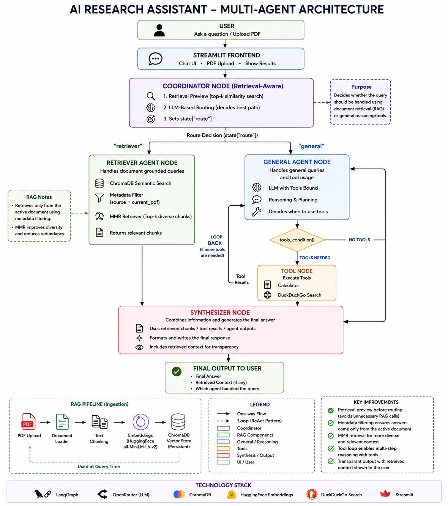

# AI Research Assistant — Multi-Agent System

## Overview

AI Research Assistant is a multi-agent AI system built using LangGraph, Retrieval-Augmented Generation (RAG), and tool-calling capabilities. The system can answer general knowledge questions, retrieve information from uploaded PDF documents, and utilize external tools such as web search and a calculator when required. A retrieval-aware Coordinator Agent intelligently routes queries to either a Retriever Agent or a General Agent, improving response quality while avoiding unnecessary retrieval operations.

The system was designed with modularity, transparency, and explainability in mind. Retrieved context is displayed alongside generated answers, allowing users to verify the source of information used in responses.

---

# Architecture



### System Flow

1. User submits a query through the Streamlit interface.
2. The Coordinator Agent performs a lightweight retrieval preview from the active document.
3. The Coordinator uses an LLM to determine whether the query should be handled by:

   * Retriever Agent (document-grounded questions)
   * General Agent (general reasoning and tool usage)
4. The General Agent may invoke tools through a Tool Node using a ReAct-style loop.
5. The Retriever Agent retrieves relevant document chunks using ChromaDB and MMR retrieval.
6. The Synthesizer Agent generates the final response.
7. Retrieved context is displayed to ensure transparency.

---

# Agents

## Coordinator Agent

The Coordinator Agent acts as the decision-making layer of the system.

### Responsibilities

* Query classification
* Retrieval preview
* Route selection
* Avoid unnecessary RAG calls

### Routing Strategy

Before making a routing decision, the Coordinator performs a lightweight retrieval preview against the active document.

If the retrieved preview contains relevant information, the query is routed to the Retriever Agent.

Otherwise, the query is routed to the General Agent.

This retrieval-aware routing improves routing accuracy compared to keyword-based classification.

---

## Retriever Agent

The Retriever Agent handles document-grounded questions.

### Responsibilities

* Semantic document retrieval
* Context extraction
* Metadata filtering
* Returning relevant chunks

### Features

* ChromaDB Vector Store
* HuggingFace Embeddings
* Metadata filtering using current PDF
* MMR Retrieval
* Top-k relevant chunk retrieval

The Retriever Agent ensures answers remain grounded in the uploaded document.

---

## General Agent

The General Agent handles:

* General knowledge questions
* Reasoning tasks
* Mathematical calculations
* Web searches

### Features

* Tool calling
* ReAct-style reasoning
* Multi-step decision making
* Dynamic tool selection

The General Agent determines when external tools are required and loops through tool execution until enough information has been gathered.

---

## Synthesizer Agent

The Synthesizer Agent generates the final user-facing response.

### Responsibilities

* Combines agent outputs
* Formats responses
* Displays retrieved context
* Produces final answer

Separating synthesis from retrieval and reasoning improves maintainability and modularity.

---

# RAG Pipeline

The document retrieval pipeline consists of:

```text
PDF Upload
    ↓
Document Loader
    ↓
Text Chunking
    ↓
HuggingFace Embeddings
(all-MiniLM-L6-v2)
    ↓
ChromaDB Vector Store
    ↓
Metadata Filtering
(source = current_pdf)
    ↓
MMR Retriever
    ↓
Relevant Chunks
```

### Retrieval Strategy

The system uses:

* ChromaDB persistent storage
* Sentence Transformer embeddings
* Metadata filtering
* MMR retrieval

### Why MMR?

Maximal Marginal Relevance (MMR) improves retrieval quality by balancing:

* Relevance
* Diversity

This reduces redundant chunks and improves context coverage.

---

# Tools

## Calculator Tool

Used for:

* Arithmetic operations
* Numerical reasoning
* Mathematical calculations

Examples:

* 125 × 67
* Percentage calculations
* Formula evaluation

---

## DuckDuckGo Search Tool

Used for:

* Current information retrieval
* Public web lookups
* Fact verification

Examples:

* Current richest person
* Recent AI developments
* Latest technology news

---

# Design Decisions

## Why LangGraph Instead of Simple Chains?

LangGraph provides:

* State management
* Conditional routing
* Agent orchestration
* Tool execution loops

These capabilities make multi-agent workflows significantly easier to implement and maintain.

---

## Why ChromaDB Instead of DuckDB?

ChromaDB offers:

* Native vector search
* Metadata filtering
* Persistent storage
* Tight LangChain integration

This makes it better suited for document retrieval workloads.

---

## Why Retrieval Preview in the Coordinator?

A common issue in RAG systems is poor routing decisions.

Instead of routing based only on the query, the Coordinator performs a lightweight retrieval preview and uses the retrieved context to make a more informed decision.

### Benefits

* Avoids unnecessary RAG calls
* Improves routing accuracy
* Reduces retrieval noise
* Improves overall response quality

---

## Why MMR Instead of Similarity Search?

Traditional similarity search often retrieves highly similar chunks.

MMR balances:

* Relevance
* Diversity

This produces more informative context and reduces duplication.

---

## Why a Separate Synthesizer Agent?

Separating synthesis from retrieval and reasoning improves:

* Modularity
* Maintainability
* Explainability

Each agent focuses on a single responsibility.

---

# Tradeoffs

## ChromaDB vs DuckDB

### ChromaDB

Advantages:

* Optimized vector search
* Metadata filtering
* Retrieval-friendly architecture

Disadvantages:

* Additional dependency
* Slightly larger storage footprint

### DuckDB

Advantages:

* Lightweight
* Excellent analytical performance

Disadvantages:

* Not designed primarily for vector retrieval

---

## MMR vs Similarity Search

### MMR

Advantages:

* More diverse retrieval
* Less redundancy

Disadvantages:

* Slightly slower

### Similarity Search

Advantages:

* Faster retrieval

Disadvantages:

* Higher chance of duplicate chunks

---

# Observability

## LangSmith Integration

LangSmith is used for:

* Agent tracing
* Execution monitoring
* Prompt inspection
* Workflow debugging
* Token usage tracking

Benefits:

* Easier debugging
* Improved transparency
* Better development workflow

---
# Evaluation Dataset

| Query                                           | Expected Route                    | Purpose                |
| ----------------------------------------------- | --------------------------------- | ---------------------- |
| What is RLHF?                                   | Retriever Agent                   | Document retrieval     |
| What is Perplexity?                             | Retriever Agent                   | RAG quality evaluation |
| Explain FlashAttention.                         | Retriever Agent                   | Technical retrieval    |
| What is an LLM Agent?                           | Retriever Agent                   | Concept retrieval      |
| What is a rocket?                               | General Agent                     | General knowledge      |
| Who is the Father of the Nation of India?       | General Agent                     | General reasoning      |
| Calculate 125 × 67                              | General Agent + Calculator        | Tool usage             |
| What happened in AI this week?                  | General Agent + DuckDuckGo Search | Web search             |
| Who is the current richest person in the world? | General Agent + DuckDuckGo Search | Current information    |

---
# Project Structure

```text
ai_research_agent/
│
├── agents/
│   ├── coordinator.py
│   ├── general_agent.py
│   ├── retriever_agent.py
│   └── synthesizer.py
│
├── graph/
│   ├── graph_builder.py
│   └── state.py
│
├── rag/
│   ├── ingest.py
│   └── retriever.py
│
├── app.py
├── requirements.txt
├── README.md
└── architecture.png
```

---

# Setup & Running

## Clone Repository

```bash
git clone <https://github.com/Somils1/AI-Research-Assistant.git>
cd ai_research_assistant
```

## Create Virtual Environment

```bash
python -m venv .venv
```

## Activate Environment

Windows:

```bash
.venv\Scripts\activate
```

Linux / Mac:

```bash
source .venv/bin/activate
```

## Install Dependencies

```bash
pip install -r requirements.txt
```

## Configure Environment Variables

Create a `.env` file:

```env
OPENROUTER_API_KEY=your_api_key
LANGCHAIN_API_KEY=your_langsmith_key
```

## Run Application

```bash
streamlit run app.py
```

---

# Tech Stack

### Frameworks

* LangGraph
* LangChain
* Streamlit

### LLM

* Gemini 2.5 Flash (via OpenRouter)

### Retrieval

* ChromaDB
* HuggingFace Embeddings
* Sentence Transformers (all-MiniLM-L6-v2)

### Tools

* DuckDuckGo Search
* Calculator

### Observability

* LangSmith

### Language

* Python

---

# Key Highlights

* Multi-Agent Architecture
* Retrieval-Aware Query Routing
* ChromaDB-based RAG Pipeline
* Tool Calling with ReAct Pattern
* Metadata-Based Document Filtering
* MMR Retrieval Strategy
* Transparent Retrieved Context Display
* LangSmith Observability
* Streamlit User Interface
* Modular and Extensible Design
